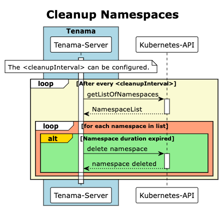

# temporary namespace manager (tenama)

Tenama provides a simple REST API that allows non-cluster administrators in a shared Kubernetes environment to create temporary namespaces. tenama handles the creation, management, and cleanup of the temporary namespaces.

[](https://api.securityscorecards.dev/projects/github.com/Payback159/tenama)

## Running the server

```bash
nerdctl build . -t tenama
nerdctl run --rm -p 8080:8080 -v ./config.yaml:config.yaml tenama
```

## Create Namespace Sequence-Diagram

[]()

## Cleanup Namespaces Sequence-Diagram

[]()

test